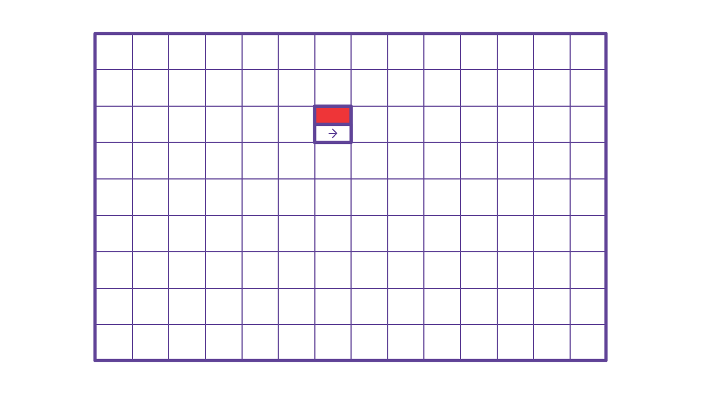

# webscript-papertracker

Gamified music &amp; tech teaching tool

An educational platform for engaging 14–140 year-olds with music, technology, and game design. The focus is on providing entertaining challenges inexpensively, that promote creative problem solving, collaborative work, and programming using visual apparatus.

## Step 1: Place Tiles

## Step 2: Take Photo

## Step 3: Simulation

---

## to-do:

* ~~animated presentation~~
* client-side board simulation
  * ~~rewrite piece rules~~
  * remove pulse if it passes the border
  * ~~add sounds ([tonejs integration?](https://tonejs.github.io/))~~
  * ~~wingding / font-awesome / sprite solution~~
  * ...
* client-photo submission
* server-side grid and tile detection
* ...
