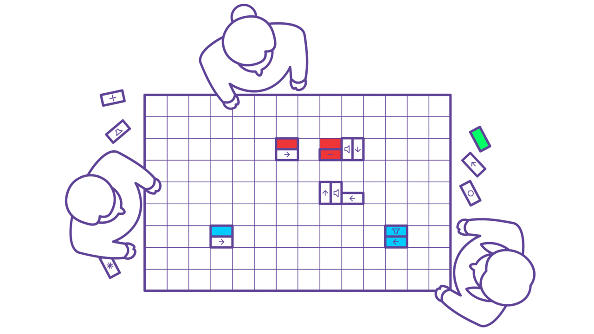
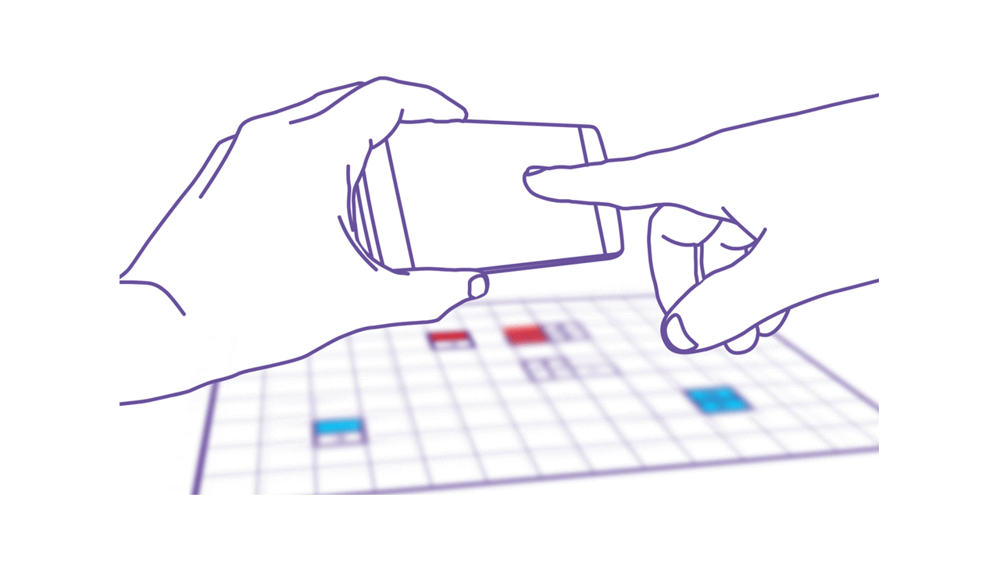
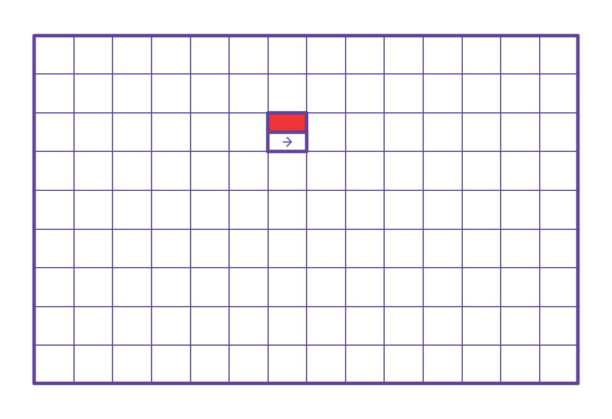

# PaperTracker

*Gamified music &amp; tech teaching tool*

An educational platform for engaging 14–140 year-olds with music, technology, and game design. The focus is on providing entertaining challenges inexpensively, that promote creative problem solving, collaborative work, and programming using visual apparatus.

[live demo](https://papertracker.cmp.ac.nz/)

---

## step 1: place tiles

## step 2: take photo

## step 3: simulation

---

## run

1. cd to *webserver* directory
2. create virtual environment: `python -m venv env`
3. activate virtual environment: `source env/bin/activate`
4. install packages: `pip install -r requirements.txt`
5. set environment variables: `export FLASK_APP=run.py`
6. for flask debug mode: `export FLASK_DEBUG=1`
7. run the server: `flask run`
8. open website in browser: `http://localhost:5000`

## features

- [ ] opencv detect tile grid coordinates
- [ ] flask to return tile coordinates
- [ ] place tiles (after above step)
- [ ] add pulse collision rule(s)
- [ ] monitor interface (to observe what the user sees on their phone)
- [ ] server-side grid and tile detection?
- [ ] during simulation, option to step (and step backward?)
- [ ] orientable arrow tile

## bugs

- [x] convert to single page app
 - [ ] camera and fullscreen should be prompted on splash/instructions page
 - [x] re-snap button must not reload the page
- [ ] tone stutter (after multiple plays)
